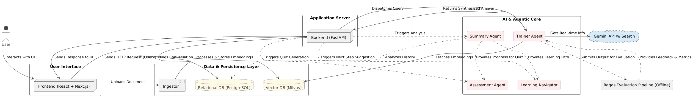

# Personal Learning Portal Report

## 1. Introduction & Learning Goals

### Domain Overview
In just a few short years, Large Language Models (LLMs) have completely reshaped the field of Natural Language Processing (NLP). This rapid evolution, largely kicked off by the introduction of the transformer architecture in 2017 (Vaswani et al.), has moved the technology from academic labs to the forefront of global innovation. The pace is relentless; new models, techniques, and applications appear almost weekly, making it incredibly difficult to follow the signal through the noise.

This information overload was the primary motivation for this project. I wanted to build a Personal Learning Portal (PLP) not just to learn about LLMs, but to create a tool for learning. My goal was to develop a system that could navigate a curated set of high-quality sources from foundational papers to modern explainers and synthesize clear, reliable answers. This PLP uses a Retrieval-Augmented Generation (RAG) system to ground its responses in facts, helping a user (in this case, myself) build a deep and accurate understanding of this complex domain.

### Learning Questions
To structure this learning journey, I centered the project on answering a set of core questions that move from foundational principles to the cutting edge:

Here are learning questions based on your provided topics:

1. **How** do tokenization, embeddings, attention mechanisms, and decoder stacks interact to form the core architecture of LLMs
2. **How** does autoregressive generation enable effective language modeling and sequence prediction?
3. **What** are the differences between prompt engineering, instruction tuning, LoRA, and distillation for adapting LLMs?
4. **How** can adaptation strategies be justified based on performance, efficiency, and domain requirements?
5. **How** can benchmark datasets (such as MMLU and GSM8K), alignment criteria, and output diagnostics be used to evaluate LLM reasoning, alignment, and behavior?
6. **What** techniques can improve factual accuracy and safety?
7. **How** can LLMs be applied to functional tasks like retrieval, summarization, classification, and conversational agents?
8. **What** engineering strategies (e.g., quantization, batching, caching, compression) can be used to optimize LLM inference workflows
9. **How** can tradeoffs between accuracy, latency, and infrastructure cost be balanced for scalable deployment?

### Learning Objectives

By using the PLP to investigate these questions, I aimed to achieve the following concrete learning outcomes:
1. Analyze the transformer architecture and contrast its parallel processing capabilities against the sequential nature of recurrent networks.
2. Articulate how patterns like Retrieval-Augmented Generation (RAG) are used to make LLMs more factually grounded and suitable for enterprise use (Lewis et al.).
3. Identify the key organizations and foundational models (e.g., GPT-3, Llama 2, Claude) that represent major milestones in the field.
4. Critically evaluate the significant ethical risks and societal implications of LLMs, such as their capacity to perpetuate bias and generate convincing misinformation (Bender et al.).

## 2. Search Strategy & Source Curation
To build a robust and relevant learning corpus for the PLP, I adopted a two-pronged search strategy. This approach was deliberately designed to balance the academic rigor of foundational texts with the fast-evolving, real-time nature of the LLM landscape.

### Strategy 1: Curating a Foundational Corpus from Course Materials
The initial set of documents was sourced directly from the required and recommended readings of the "Applications of NL(x) and LLMs" course. This served as the academic backbone for the PLP. These materials, having been pre-vetted for quality and significance by professor Anand Rao, ensuring that the system was grounded in the seminal research and core principles that underpin the entire field. This collection primarily consisted of:
- Pioneering Research Papers: Foundational documents like "Attention Is All You Need" that introduced core architectural concepts.
- Survey Articles: Comprehensive papers that synthesize and explain the state of a particular subdomain.
- Key Explanatory Blog Posts: Articles from respected research labs and engineers that translate complex topics into more accessible language.
### Strategy 2: Dynamic Search with a Grounded LLM
The field of LLMs progresses so rapidly that even a current syllabus can miss breakthroughs that are weeks or months old. To address this, my second strategy involved a dynamic search process using the Google Gemini API with its integrated search grounding feature.

I programmatically queried the API with my learning questions, prompting it to find and synthesize information based on real-time Google Search results. This allowed the PLP to incorporate the most current information. This method ensured the corpus was timely and reflected the state-of-the-art as of late 2025. You can find more information on this capability at the official [Google AI documentation](https://ai.google.dev/gemini-api/docs/google-search).

### Source Curation
I used the [following resources](#learning-resources-citations) to ground my vector database.

## 3. System Design

Can be better viewed [here](https://www.plantuml.com/plantuml/png/TLHHRzis47xdhxXvG9TWS0eCMBVsOQWIsvi1jtNjPE-qT9QvKgJ6e-mfm_xxZY8hqG6Qbr1tttsy--wZtvENpdUD5j_v4pO8PtLmqdWXw8iohNIoWT8shJLe_Dxt6e71FsNPLfPVP8qnvx3qqjGQCm0dZOT_1V3VFODhPpjJFLXj7No_MYmNouUOiwv2b-B5ps_UtY_4VnbF9RqyIC9lKYrNRvU_N9MKsdRLj_2BDyjYzIlZXImz1vu8dH1f79Y5JrWRZ-ueIvmb5cChpgsSvOIfu6Q7N0m_maVynz_zHRSpa0HVqymzyHLjgrKflR86zkZEwAuvGty3vKgIBxRhI9MYrqnhU0L5K5MLy63Ts5nKUlRef3Be8cHWIP4SjE-QHhe-0wL83jgWT4QP6ZxAiwebgnIGqrUEBOYGgE5pnZa5hoPOI2zvXYqwKkJHb0WRsK-AZAkU_Od3RXRtSFD1wNEN58xd5zWTwa5UgGVyrfAl7Uu_RsBDz1tg9bV3R6rgf31SQ39wPlOxDieeu4N0vJKlJBhoDD34X1YTplVAckFBizHTNEzMjQYLGRZvT3o6GsnWm0dn0ypdSzwRCLW6E8Nl4DuwDQnaL7rZRJjOJC-zQl1M14yo-hVHOV0kMfHDI71H_WHFQp4c6PZymxWz_oFuu_5n2plykqFoSFEvGzVVYW1A-EGKnYyKjTAN9oGOO2Ab69NaPz0A8sBP7B2gk6VAOKd3TtpWziOvkEMZdN1vbmpodJDinjvu9bRFM45Xw89kx3AVVvnhXyJR90HlMOAWvk2nkDcmavMsbroPbB9XrATMMyaa2rjsWrV7N3xhrjaIWv_PkNjENe_DD_9Ap-WeUc1ZwveJcRQP0PcDytHL4HXsUDJ156U43-Zb_8KJ2kfDUU8PR4Ul7vsgQtHOtOglR_dkxiKbXP6wVqPUkmhZz6Ct0Pcg69QeAE99KSuulVQemLbLI9D7jzAVSdZsv7Cy7sh7SJXQntvIprahsHLvC-4dbON6bZkjqnhpgloch2oGi-4Ckb7Mz0hp9ne47It8PF5n1ZjrXqPvWa-TRpiVsitAH4G5VAhDPrmXLWVk3rw5xJbLiYlUSxDTe_y7).

## 4. Results & Reflection

This project successfully culminated in a functional Personal Learning Portal (PLP), a multi-agent system designed to facilitate a deep and interactive learning experience. 

### RAG Performance Analysis

To quantitatively evaluate the core of the PLP—the Trainer Agent's question-answering capability—the **RAGAs framework** was selected. This choice was deliberate; unlike single-metric evaluations, RAGAs provides a multi-faceted view of the RAG pipeline's performance, breaking it down into key components. This is essential for understanding not just *if* the system is working, but *why* and where it can be improved.

The evaluation was conducted using a custom-built dataset of question-answer pairs derived directly from the unique documents ingested into the vector database. This approach was critical for generating realistic and meaningful results, as the system was tested against the specific knowledge it was expected to possess.

The final RAGAs scores were as follows:

* **Answer Relevancy:** `0.9645`
* **Context Precision:** `0.8400`
* **Context Recall:** `0.7567`
* **Faithfulness:** `0.5634`
* **Factual Correctness (f1):** `0.5084`

**Interpretation:**
The results paint a clear picture of the system's strengths and weaknesses. The exceptionally high **Answer Relevancy** (`0.96`) and strong **Context Precision** (`0.84`) indicate that the system is excellent at understanding the user's query and retrieving relevant information chunks to formulate an on-topic answer. The **Context Recall** (`0.75`) is also solid, suggesting the retriever usually finds all the necessary information to answer the question.

The moderate scores for **Faithfulness** (`0.56`) and **Factual Correctness** (`0.50`) highlight the primary area for future improvement. These scores suggest that while the answers are relevant, the model sometimes makes statements that are not strictly supported by the provided text (hallucinations) or that could not be factually verified against the ground truth. This points toward the need for further prompt engineering or an advanced retrieval strategy to ensure the model remains more tightly grounded in the source documents.

### System Architecture and Learning Experience

A key success of this project was the implementation of a **multi-agent modular architecture**. The system's intelligence is not monolithic but distributed across four distinct agents that work in concert to create a holistic learning loop:

1.  **Trainer Agent:** The core conversational engine that provides detailed, context-aware answers.
2.  **Summary Agent:** A reflective agent that works in the background to analyze conversations and distill them into long-term memory, populating the `learning_topics` database.
3.  **Learning Navigator Agent:** A proactive guide that uses the long-term memory from the Summary Agent to suggest relevant next steps, encouraging a structured and continuous learning path.
4.  **Assessment Agent:** A reinforcement tool that solidifies knowledge by generating targeted quizzes on topics where the user has shown sufficient engagement.

### Challenges and Future Work

One of the primary challenges encountered was the planned ingestion of YouTube video content. The initial approach was to use LangChain's `YoutubeLoader`; however, this component is **currently broken**. Its core dependency, `pytube`, has not been reliably maintained to keep up with changes to YouTube's internal API, making it unusable for this project.

As a workaround, an attempt was made to use the more robust command-line tool **`yt-dlp`**. The goal was to download videos and automatically generate subtitle (`.srt`) files, which could then be loaded into the vector database using LangChain's `SRTLoader`. Despite successfully installing `yt-dlp` and its required local binaries, the tool was unable to consistently generate the necessary SRTs for the target videos.

Without a reliable source of text transcripts from the videos, this feature had to be postponed. For future work, a more resilient solution would be to create a pipeline that uses `yt-dlp` to download the audio stream of a video and then processes that audio with a dedicated speech-to-text API, such as OpenAI's Whisper or Google's Speech-to-Text, to generate a high-quality transcript for ingestion.

## References
Bender, Emily M., et al. "On the Dangers of Stochastic Parrots: Can Language Models Be Too Big? " Proceedings of the 2021 ACM Conference on Fairness, Accountability, and Transparency, 2021, pp. 610-23, doi:10.1145/3442188.3445922.

Lewis, Patrick, et al. "Retrieval-Augmented Generation for Knowledge-Intensive NLP Tasks." Advances in Neural Information Processing Systems 33, 2020, pp. 9459-74. arXiv, arxiv.org/abs/2005.11401.

Vaswani, Ashish, et al. "Attention Is All You Need." Advances in Neural Information Processing Systems 30, 2017. arXiv, arxiv.org/abs/1706.03762.

## Learning Resources Citations

1.  **Citation:** Karim, R. (2019, September 12). *Illustrated Self-Attention*. Towards Data Science.
    * **Justification:** This guide is chosen because it intuitively explains the self-attention mechanism, a fundamental component of the Transformer architecture that underpins most modern Large Language Models.

***

2**Citation:** Alammar, J. (2018, June 27). *The Illustrated Transformer*. Jay Alammar's Blog.
    * **Justification:** This article is selected for its detailed, visual explanation of the entire Transformer architecture, which is the foundational model design for the vast majority of today's LLMs.

***

3.  **Citation:** Gao, Y., Xiong, Y., Gao, X., Jia, K., Pan, J., Bi, Y., Dai, Y., Sun, J., & Wang, M. (2024). *Retrieval-Augmented Generation for Large Language Models: A Survey*. arXiv:2312.10997v5.
    * **Justification:** This survey is included for its comprehensive overview of Retrieval-Augmented Generation (RAG), a key technique for enhancing LLMs with external knowledge to improve factual accuracy and reduce hallucinations.

***

4.  **Citation:** Ji, Z., Lee, N., Fries, R., Yu, T., Su, D., Xu, Y., Ishii, E., Bang, Y. J., Madotto, A., & Fung, P. (2024). *A Survey of Language Model Alignment*. arXiv:2402.07927v2.
    * **Justification:** This survey is chosen because it covers the critical topic of language model alignment, which is the process of ensuring that an LLM's behavior is helpful, harmless, and aligned with human values.

***

5.  **Citation:** Lam, N. (2023). *A Guide to Reinforcement Finetuning*. Nathan Lam's Blog.
    * **Justification:** This guide is selected to explain the mechanics of reinforcement learning from human feedback (RLHF), a pivotal technique used to fine-tune LLMs to better follow instructions and align their outputs with human preferences.

***

6.  **Citation:** Zhong, Z., Yuan, Z., Yuan, H., Shu, Y., & Liu, Z. (2023). *A Comprehensive Survey of AI Alignment*. arXiv:2310.19852v6.
    * **Justification:** This comprehensive survey is included to provide a broad, foundational understanding of the entire field of AI alignment, contextualizing the specific challenges of aligning LLMs within the larger goal of creating safe and beneficial AI systems.

***

7. **Citation:** Yu, H., Gan, A., Zhang, K., Tong, S., Liu, Q., & Liu, Z. (2024). Evaluation of Retrieval-Augmented Generation: A Survey. arXiv:2405.07437v2.
   * **Justification:** This survey is chosen because it provides a comprehensive overview of the metrics and benchmarks essential for evaluating the performance of the Retrieval-Augmented Generation (RAG) systems.

***

8. **Citation:** Wang, F., Zhang, Z., Zhang, X., Wu, Z., Mo, T., Lu, Q., Wang, W., Li, R., Xu, J., Tang, X., He, Q., Ma, Y., Huang, M., & Wang, S. (2024). A Comprehensive Survey of Small Language Models in the Era of Large Language Models. arXiv:2411.03350v2.
   * **Justification:** This document is selected for its detailed exploration of Small Language Models (SLMs), that utilize a smaller model with comparable performance in specialised tasks.

***

9. **Citation:** Schopf, T. (2023, September 23). A Taxonomy of Natural Language Processing. Towards Data Science.
   * **Justification:** This article is included to provide a structured, high-level taxonomy of the Natural Language Processing field.

***

10. **Citation:** Phi, M. (2018, September 19). Illustrated Guide to Recurrent Neural Networks. TDS Archive, Medium.
   * **Justification:** This guide is chosen to cover the foundational concepts of Recurrent Neural Networks (RNNs), offering an intuitive understanding of how sequential data is processed, which is a core topic in AI literacy.

***

11. **Citation:** Phi, M. (2018, September 24). Illustrated Guide to LSTM’s and GRU’s: A step by step explanation. TDS Archive, Medium.
   * **Justification:** This document is selected as a follow-up to the RNN guide, explaining the architecture of LSTMs and GRUs, which were developed to overcome the limitations of traditional RNNs and are key historical and conceptual building blocks in NLP.

***

12. **Citation:** Han, Z., Gao, C., Liu, J., Zhang, J. J., & Zhang, S. Q. (2024). Parameter-Efficient Fine-Tuning for Large Models: A Comprehensive Survey. arXiv:2403.14608v7.
   * **Justification:** This survey is chosen for its in-depth review of Parameter-Efficient Fine-Tuning (PEFT) techniques, which are critical for efficiently adapting large models like Llama 3 for specialized tasks.

***

13. **Citation:** Saad-Falcon, J., Khattab, O., Potts, C., & Zaharia, M. (2024). ARES: An Automated Evaluation Framework for Retrieval-Augmented Generation Systems. arXiv:2311.09476v2.
   * **Justification:** This paper is included because it presents ARES, a specific and automated framework for evaluating RAG systems, offering a practical methodology for system evaluations.

***

14. **Citation:** Baheti, P. (2021, May 27). Activation Functions in Neural Networks [12 Types & Use Cases]. V7 Labs Blog.
   * **Justification:** This guide is selected to cover the fundamental role of activation functions in neural networks, a crucial concept for underlying mechanics of deep learning.

***

15. **Citation:** Moslemi, A., Briskina, A., Dang, Z., & Li, J. (2024). A survey on knowledge distillation: Recent advancements. Machine Learning with Applications, 18, 100605.
    * **Justification:** This survey on knowledge distillation is relevant because this technique helps understand teacher model to improve the performance of a smaller student model.