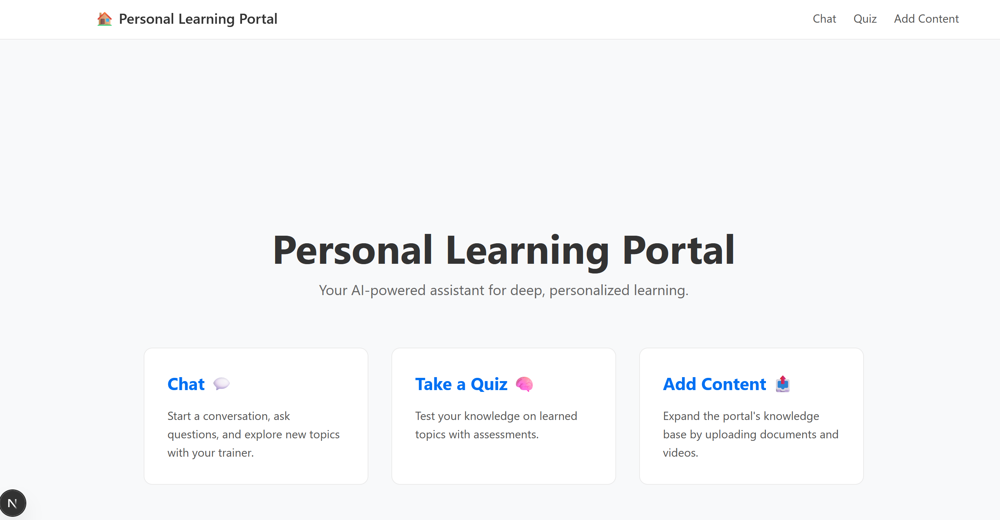
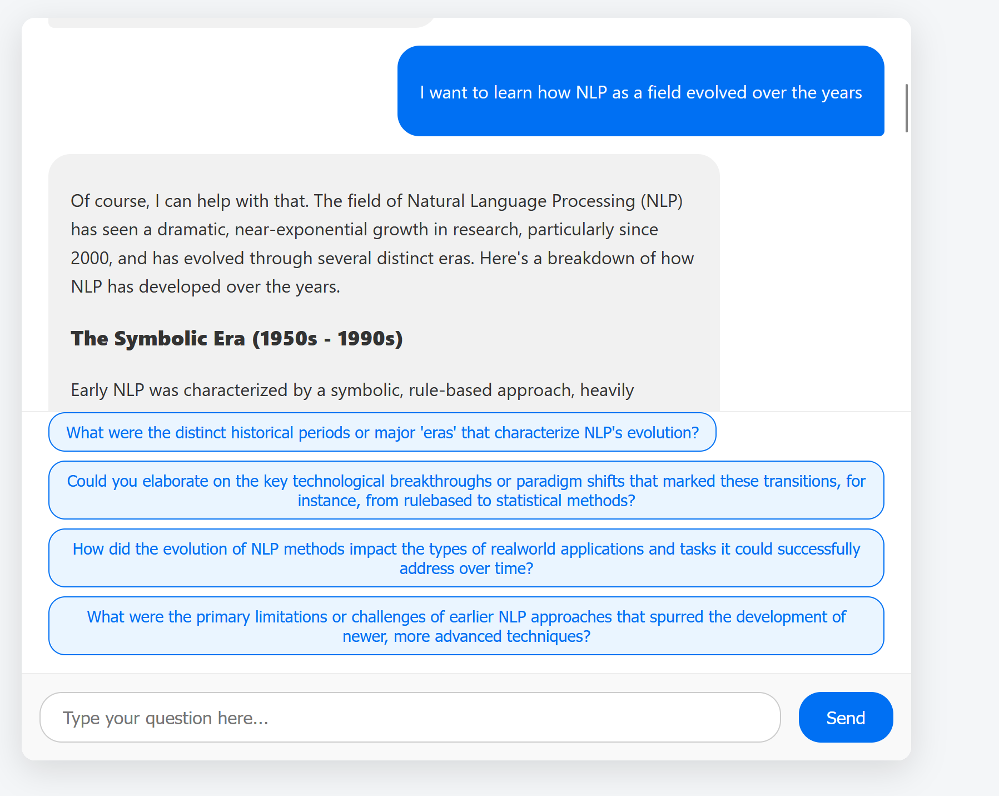
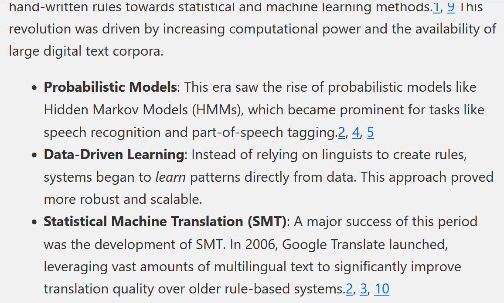
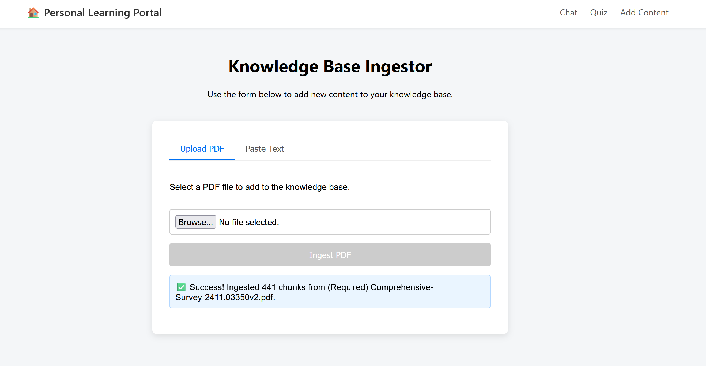
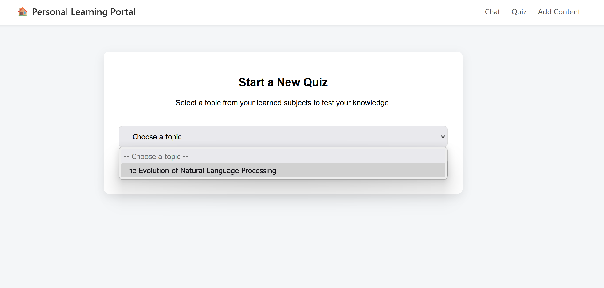
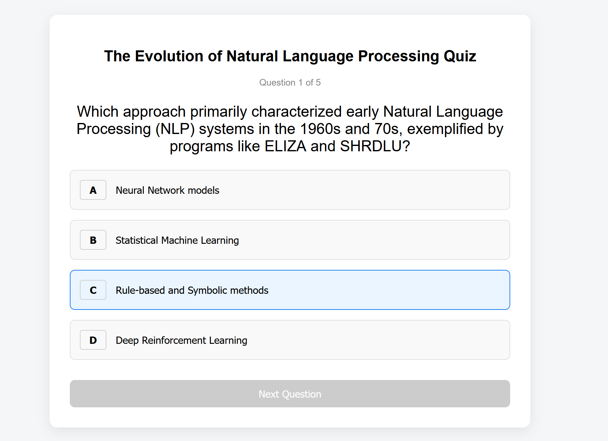
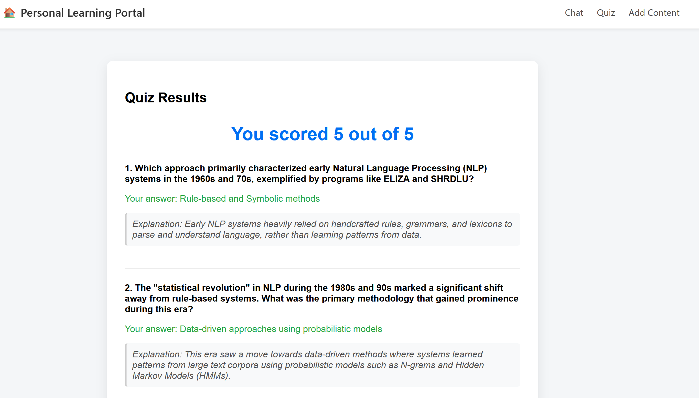

# Interface Report

## Home page
As a curious learner, my journey with the Personal Learning Portal (PLP) begins the moment I log in. I'm immediately greeted by a clean, intuitive Home Page. This isn't just a static landing page; it's my launchpad, clearly outlining the three main pathways to deepen my understanding: engaging in conversation via "Chat," expanding the portal's knowledge with "Add Content," and solidifying my learning through "Quiz." It sets the stage for a truly personalized educational experience.

## Chat Page
My primary interaction often starts with the Chat interface. It feels natural, like talking to an intelligent tutor. When I land on the chat page, the portal usually provides a friendly greeting, along with a set of four proactive prompts from the Learning Navigator. These prompts are incredibly helpful, often suggesting logical next steps based on our past discussions, pushing me to consider related concepts I hadn't thought of.

The Trainer Agent springs into action, and after a short moment, a detailed response appears. What I particularly love about the Trainer's response is the inclusion of citation URLs. If the information comes from a web search or an ingested document, these links are embedded directly within the answer, allowing me to click and delve deeper into the source material if I want to verify or explore further. This transparency builds immense trust in the information provided. The chat keeps flowing, with new suggestions appearing after each exchange, making learning a continuous, guided discovery.

## Ingestor

Sometimes, I come across a great article or a fantastic YouTube lecture (or at least, the transcript of one) that I want to integrate into my learning. That's where the Ingestor comes in. Navigating to the "Add Content" section brings me to a straightforward UI. I can easily switch between "Upload PDF", "Paste Text"" "Add YouTube URL" (though I know the YouTube feature is still in development due to some technical hiccups).

If I have a PDF document, I just click "Choose File," select my document, and hit "Ingest PDF." The portal processes it, extracts key information, and adds it to its growing knowledge base. A clear success message confirms that the document has been ingested, and the number of chunks added gives me a sense of the scale of new information available. This means my future chats and quizzes will now have access to this new context, making the PLP truly my own personalized learning repository.

## Quizzes

After several chat sessions on a topic, or after ingesting new material, I often feel ready to test my understanding. I navigate to the Quiz Page.

The first thing I see is a topic selection dropdown. This is powered by the Summary Agent, which has been diligently tracking my conversations and identifying key learning topics. I can simply select a topic like "Quantum Mechanics" or "Machine Learning Fundamentals" from the list. Once selected, I click "Start Quiz."

The portal instantly generates a 5-question multiple-choice quiz based on the chosen topic. Each question is clearly presented with four options (A, B, C, D). I click my chosen answer. 

Once I've completed all five questions, the portal presents my quiz results, showing my score out of five. It also provides a comprehensive review of all the questions, my answers, the correct answers, and the explanations. This allows me to quickly revisit areas where I might still be weak. If I feel like revisiting another topic, a simple "Try Another Topic" button takes me right back to the selection screen.
